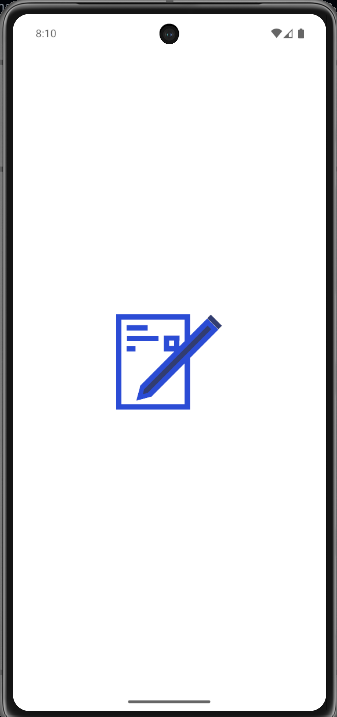
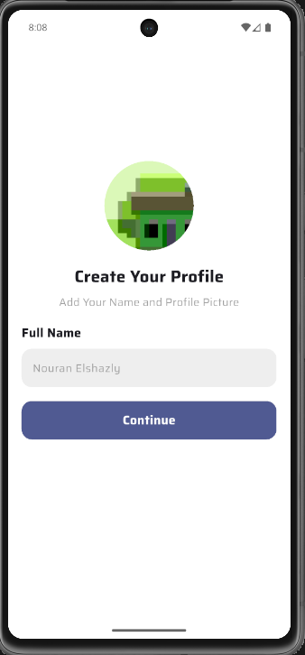
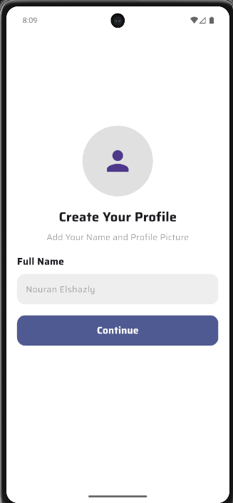
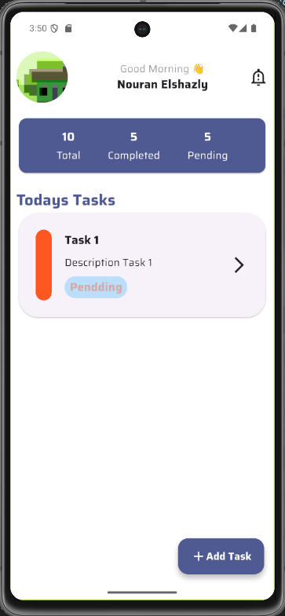
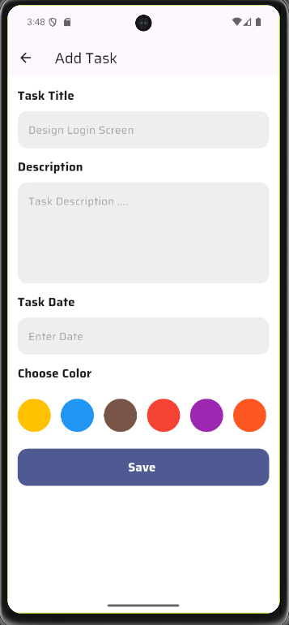
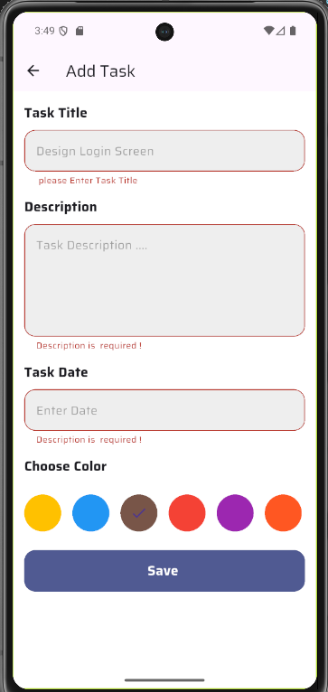

# To-Do App

A simple to-do list app built with Flutter.

## Features

- **Splash Screen**: Beautiful animated loading screen on app startup
- **Authentication**: Secure login and sign-up with local data persistence
- **Task Management**: Create, read, update, and delete tasks with Hive storage
- **Task Organization**: Organize and categorize your tasks efficiently
- **Internationalization**: Multi-language support with proper date/time formatting
- **Image Support**: Pick and attach images to tasks
- **Local Storage**: Fast and reliable offline storage using Hive database
- **Animations**: Smooth transitions and lottie animations for better UX

## Screenshots

| Splash                           | Auth                             | Home                               |
| -------------------------------- | -------------------------------- | ---------------------------------- |
|  |         |           |
| Home                             | Add Task                         | Validation                         |
| -------------------------------- | -------------------------        | -------------------------          |
|    |  |  |

## Getting Started

1. Install [Flutter](https://docs.flutter.dev/get-started/install).
2. Install dependencies:
   ```
   flutter pub get
   ```
3. Run the app:
   ```
   flutter run
   ```

## Tech Stack

- **Flutter**: Cross-platform UI framework
- **Dart**: Programming language
- **Hive**: Fast, lightweight local database for storing tasks and user data
- **hive_flutter**: Hive integration with Flutter
- **image_picker**: Plugin for selecting images from device
- **lottie**: Animation library for smooth Lottie animations
- **intl**: Internationalization and localization support for dates and times
- **Custom Fonts**: Saira font family for consistent typography

## Project Structure

```
lib/
├── main.dart                          # App entry point with Hive initialization
├── to_do_app.dart                     # Main app configuration and routing
├── core/                              # Core utilities and shared resources
│   ├── theme/
│   │   ├── app_color.dart            # Color palette and color constants
│   │   └── app_text_style.dart       # Text styles and typography
│   ├── utils/
│   │   └── app_constant.dart         # Application constants and config
│   └── widgets/
│       ├── app_button.dart           # Reusable button widget
│       └── custome_text_form.dart    # Custom text form field widget
└── features/                          # Feature modules (Clean Architecture)
    ├── add_task/                      # Add/Create task feature
    │   ├── data/
    │   │   └── models/
    │   │       └── task_model.dart   # Task data model with Hive adapter
    │   └── ui/
    │       └── add_task_screen.dart  # Task creation screen
    ├── auth/                          # Authentication feature
    │   ├── data/
    │   │   └── models/
    │   │       └── user_model.dart   # User data model with Hive adapter
    │   └── ui/
    │       └── auth.dart             # Login/signup screen
    ├── home/                          # Home/task list feature
    │   ├── data/
    │   │   └── models/
    │   └── ui/
    │       └── home.dart             # Main home screen with task list
    └── splash/                        # Splash screen feature
        ├── data/
        │   └── models/
        └── ui/
            └── splash_screen.dart    # Loading/splash screen
```

### Architecture Highlights

- **Clean Architecture**: Separation of concerns with `data` and `ui` layers
- **Hive Database**: Local persistence for users and tasks
- **Model Adapters**: Generated Hive adapters for type-safe data storage
- **Reusable Components**: Shared widgets and utilities in `core` module

## Recent Updates

- ✨ Added internationalization support with `intl` package for multi-language support
- 💾 Integrated Hive database for fast and efficient local storage
- 🎨 Enhanced UI with better animations and transitions using Lottie
- 📱 Improved responsive design for various screen sizes
- 🔒 Enhanced authentication security with local data persistence
- 🎭 Applied custom Saira font family for consistent typography

## Future Enhancements

- Cloud synchronization with Firebase
- Task reminders and notifications
- Dark mode support
- Offline mode with local database
- Task categories and tags

## Contributing

Contributions are welcome! Feel free to open issues and pull requests to help improve the app.

## License

This project is licensed under the MIT License.
